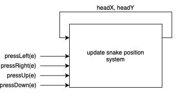
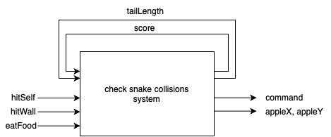
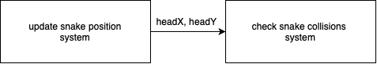

# Temporal Snake Logic (TSL) - Program Synthesis Seminar 2023

The Snake Game created with TSL, JavaScript, and HTML5.

## Project Overview and Game Rules
For this project, I sought to create a game governed by a system generated through program synthesis rather than manual programming. 
The Snake is a game where the player controls a snake that moves around the screen, trying to collect apples.

The rules of the game are simple:
1. If the snake hits itself, the game ends.
2. If the snake hits a wall, the game ends.
3. If the snake hits an apple, both the snake's length and the player's score increase by 1.

## Reactive System Development
The first step in TSL spec development is to figure out the inputs, outputs, and cells of your system.
I started out approaching this problem with one system in mind that dealt with updating the snake's position and reacting to collisions.
Further in the development process, I decided to split the reactive system up into two systems, one for controlling position and the other for controlling collisions. Two systems are better suited for this game because the snake's position must be updated and a new snake head be set before the head position can be used to check collisions.    

### Snake Position System

This reactive system controls the movement of the snake based on the up, down, left, and right arrow key presses.
The arrow key presses (<code>pressLeft(e)</code>,<code>pressUp(e)</code>, etc.) are inputs from the environment, and the snake's head position, <code>headX</code> and <code>headY</code>, are cells that are either incremented or decremented based on the inputs.

### Snake Collisions System

This reactive system controls how the snake reacts to collisions with itself, the walls, and with apples.
The inputs from the environment are boolean values (<code>hitWall</code>, <code>hitSelf</code>, and <code>eatFood</code>) that return true or false depending on the position of the snake's head and the position of the respective objects they are checking. The player's <code>score</code> and the length of the snake's tail, <code>tailHead</code>, are cells that are incremented by one every time the snake eats an apple. The outputs from the system are apple's position, <code>appleX</code> and <code>appleY</code>, and a <code>command</code> that either signals for the game to end or to continue based on the inputs from the environment.

### System Flow

and application is to write the program as you normally would. For this step, I used code for a JavaScript Snake Game from an online tutorial[^1].

Then, I refactored that code into 
[^1]: https://github.com/Kamau-ke/How-to-buid-snake-game-with-javaScript/tree/main/snake%20game
